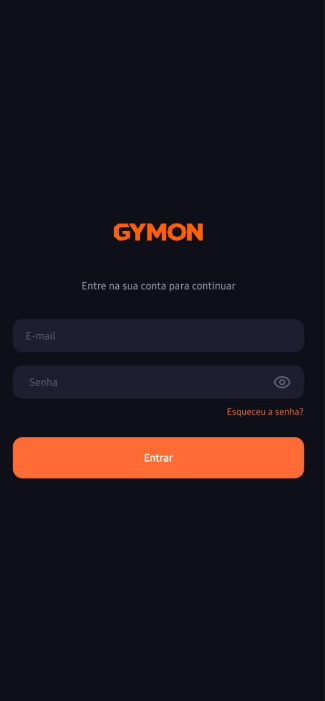
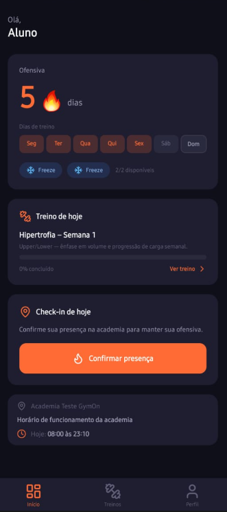
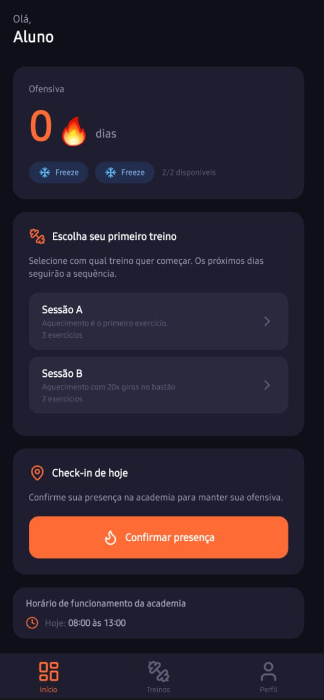
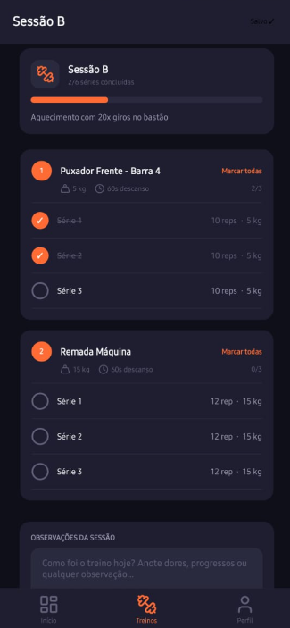
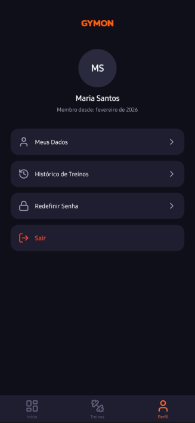
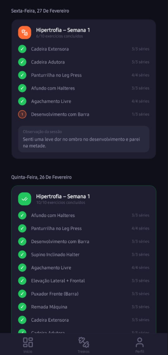
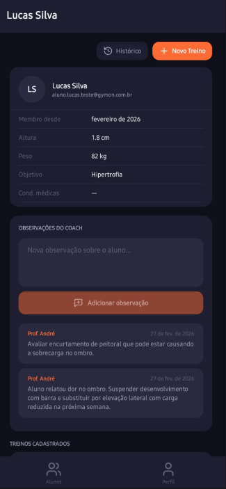
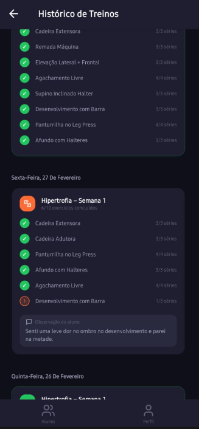

# 🏋️ GymOn

GymOn é um aplicativo offline-first desenvolvido em React Native + Expo que digitaliza fichas de treino, controla a presença dos alunos via check-in por geofence e aumenta a retenção através de um sistema de sequência de treinos (ofensiva) inspirado no Duolingo.

---

## 🛠️ Tecnologias

| Tecnologia                                                   | Versão   |
|--------------------------------------------------------------|----------|
| [React Native](https://reactnative.dev/)                     | ~0.81    |
| [Expo](https://expo.dev/) + Expo Router                      | ~54 / ~6 |
| [Firebase](https://firebase.google.com/) (Auth + Firestore)  | ^11      |
| [TypeScript](https://www.typescriptlang.org/)                | ^5.7     |
| [NativeWind](https://www.nativewind.dev/) (Tailwind para RN) | ^4       |
| [TanStack Query](https://tanstack.com/query)                 | ^5       |
| [Zustand](https://zustand-demo.pmnd.rs/)                     | ^5       |

---

## ✅ Pré-requisitos

Antes de começar, certifique-se de ter instalado:

- **Node.js** v18 ou superior — [nodejs.org](https://nodejs.org/)
- **npm** (incluso no Node.js) ou **yarn**
- **Expo Go** — instale no dispositivo Android pela [Play Store](https://play.google.com/store/apps/details?id=host.exp.exponent) para testar sem build nativo
- Uma conta no **Firebase** com um projeto criado — [console.firebase.google.com](https://console.firebase.google.com/)

---

## 🚀 Guia de Instalação

### 1. Clone o repositório

```bash
git clone https://github.com/seu-usuario/gymon.git
cd gymon
```

### 2. Instale as dependências

```bash
npm install
```

### 3. Configure as variáveis de ambiente do Firebase

Crie um arquivo `.env` na raiz do projeto com base no arquivo de exemplo:

```bash
cp .env.example .env
```

Em seguida, preencha o arquivo `.env` com as credenciais do seu projeto Firebase (encontradas em **Configurações do Projeto → Seus apps → SDK do Firebase**):

```env
EXPO_PUBLIC_FIREBASE_API_KEY=sua_api_key_aqui
EXPO_PUBLIC_FIREBASE_AUTH_DOMAIN=seu_projeto.firebaseapp.com
EXPO_PUBLIC_FIREBASE_PROJECT_ID=seu_projeto_id
EXPO_PUBLIC_FIREBASE_STORAGE_BUCKET=seu_projeto.appspot.com
EXPO_PUBLIC_FIREBASE_MESSAGING_SENDER_ID=seu_sender_id
EXPO_PUBLIC_FIREBASE_APP_ID=seu_app_id
```

> ⚠️ **Atenção:** nunca suba o arquivo `.env` para o repositório. Ele já está listado no `.gitignore`.

---

## ▶️ Como Executar Localmente

### Iniciar o servidor de desenvolvimento

```bash
npx expo start
```

Após iniciar, você verá um QR Code no terminal. Escaneie-o com o aplicativo **Expo Go** para abrir o app no seu dispositivo.

### Limpar o cache (quando necessário)

Se encontrar comportamentos inesperados após atualizar dependências ou configurações, inicie com a flag `-c` para limpar o cache do Metro Bundler:

```bash
npx expo start -c
```

### Executar diretamente no Android (requer Android Studio)

```bash
npm run android
```

---

## 🧪 Execução de Testes

O projeto utiliza **Jest** com `jest-expo` e `@testing-library/react-native`.

### Rodar todos os testes

```bash
npm test
```

### Rodar em modo watch (reexecuta ao salvar)

```bash
npm test -- --watch
```

## 👤 Perfis de Usuário

| Perfil      | Navegação   | Funcionalidades Principais                                               |
|-------------|-------------|--------------------------------------------------------------------------|
| **Aluno**   | Bottom Tabs | Dashboard com ofensiva, fichas de treino, histórico de check-ins, perfil |
| **Coach**   | Bottom Tabs | Lista de alunos, editor de fichas, observações, caixa de entrada         |
| **Gerente** | Stack       | Gestão de usuários, configuração de calendário                           |
| **Admin**   | Stack       | Configurações globais e logs do sistema                                  |

O redirecionamento após o login é feito automaticamente com base no campo `role` do usuário no Firestore.

---

## 🔒 Regras de Negócio Principais

- **Check-in por Geofence:** o GPS do aluno precisa estar dentro de um raio de **50 metros** da academia.
- **Máximo 1 check-in por dia** por aluno.
- **Ofensiva (Streak):** qualquer check-in incrementa a sequência; a sequência só é quebrada quando um dia planejado é perdido sem freeze disponível.
- **Freezes:** cada aluno tem **2 freezes por mês** (aplicados automaticamente; reiniciam no dia 1º, sem acúmulo).
- **Offline:** fichas de treino são cacheadas localmente pelo Firestore; completar exercícios funciona sem internet e sincroniza ao reconectar.

## 📱 Telas do Aplicativo

---

### Autenticação

|                Login                 |
|:------------------------------------:|
|  |

---

### Aluno

|                 Dashboard (aluno ativo)                  |               Dashboard (aluno novo na academia)               |
|:--------------------------------------------------------:|:--------------------------------------------------------------:|
|  |  |

|                Checklist do Treino                 |                  Meus Dados                  |
|:--------------------------------------------------:|:--------------------------------------------:|
|  |  |

|                Histórico de Treinos                |
|:--------------------------------------------------:|
|  |

---

### Coach

|                       Detalhe do Aluno                        |                        Histórico do Aluno                         |
|:-------------------------------------------------------------:|:-----------------------------------------------------------------:|
|  |  |